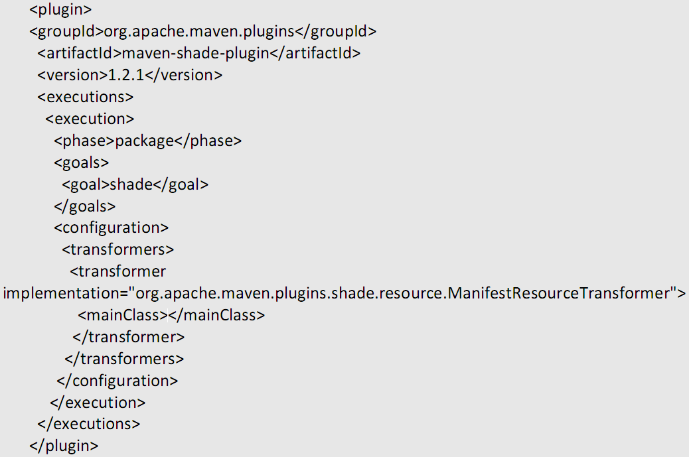

#### 安装
1. 配置java_home
maven基于java，需要先配置java_home
2. 下载apache-maven后，将其bin目录加入path。
3. 构建maven项目
	1. 编写pom.xml
	2. 在指定位置放置源文件和资源文件。
		1. src/main/java：源代码目录。
		2. src/main/resources：web项目资源文件目录
		3. src/test/java：测试源代码目录。
		4. src/test/resources：测试代码的资源文件目录。

#### pom.xml
描述了maven项目的信息。

1. <project>作为根元素
需要配置schema。如：
>
	<project xmlns="http://maven.apache.org/POM/4.0.0"
		xmlns:xsi="http://www.w3.org/2001/XMLSchema-instance"
		xsi:schemaLocation="http://maven.apache.org/POM/4.0.0 http://maven.apache.org/xsd/maven-4.0.0.xsd">
	</project>
2. `<modelVersion>4.0.0</modelVersion>`
指明POM模型的版本。很少改动。必需。
3. `<groupId>、<artifactId>、<version>、<type>`
合称为GAV。指定了项目包的坐标，用于项目打包上传后，引用项目时需要。必需。
	1. `<groupId>`
	一般使用：
		1. 使用公司网站的逆序.业务线名。
		2. com.公司名.业务线名
	2. `<artifactId>`
	一般使用：项目名.模块名
		1. 项目名=产品名。
	3. 类的包名一般使用groupId+artifactId。
	4. `<version>`
	项目的版本号。
		1. 一般使用：主版本号.次版本号.修订号
			1. 主版本号递增：产品方向改变、批量的api不兼容修改、架构不兼容升级（api可以不影响）。
			2. 次版本号递增：增加主要功能、极少的api不兼容修改。
			3. 修订号递增：增加次要功能、api兼容性修改、修复bug。
			4. 起始版本：用1.0.0，而不要用0.0.1。
		2. 支持某个范围，比如：[2.10,3.0)。
		3. 有些版本，必填；有些版本，不填则默认下最新版本。
		4. 0.1-SNAPSHOT，表示jar包是快照版
4. `<packaging>`
mvn package时打包的格式，默认为jar。
	1. pom
	配置为pom时，mvn package只是获取pom.xml文件。
		1. 部分mvn命令无效，比如mvn compile。
		2. 作为父模块或聚合模块时，必须使用。
5. `<properties>`
定义可重复使用的常量。比如：<project.build.sourceEncoding>UTF-8</project.build.sourceEncoding>，则可以使用${project.build.sourceEncoding}获得UTF-8。
	1. 预定义的常量
	`project.groupId version/packaging：获得pom.xml中定义的<groupId/version/packaging>值。`
	project.build.directory：获得tagert目录的系统路径。
	2. 与定义位置无关，定义在前面的GAV等标签中，也可以使用。
7. `<dependencies>、<dependency>`
8. `<resources>`
指定资源文件，默认为src/main/resources中的全部文件。
	1. 以下资源文件为空。
	>
		<resources>
			<resource>
				<directory>src/main/resources</directory>
		   	<excludes>
		   		<exclude>**/*</exclude>
		   	</excludes>
				</resource>
		</resources>
9. 继承相关配置
	1. 父pom.xml中配置：`<modules>`
	`内部使用<module>其它maven项目路径</module>`
	2. `<parent>`
	用于指定被继承的pom.xml配置。
	`子pom.xml会继承父pom.xml的所有配置，包括<groupId>、<artifactId>、<version>、<dependencies>等；重复定义，则会使用自定义的配置。`
	3. 父pom.xml中配置：`<dependencyManagement>`
	其内部配置的<dependency>，只是继承声明，而不会引入jar包。当子pom.xml中使用<dependency>且不指定<version>时，则会继承父pom.xml中配置的<version>。这样好处是，jar包的版本号，都由pom.xml管理。
		1. `类似功能还有<pluginManagement>。`

#### 继承和聚合
1. 继承
使用<parent>，可以从父模块继承元素
	1. 举例
	>
		<parent>
		    <artifactId>extend_parent</artifactId>
		    <groupId>extend</groupId>
		    <version>1.0-SNAPSHOT</version>
		    <relativePath>../extend_parent/pom.xml</relativePath>
		</parent>
		<artifactId>extend_parent</artifactId>
		1. `需要配置父pom.xml的<groupId>、<artifactId>、<version>。`
		2. `<relativePath>，配置所包含pom.xml的路径。`
			1. 不以/开头，相对于当前pom.xml文件所处目录的系统路径。
			2. 默认为../pom.xml，文件不存在时，会去仓库中寻找。
	2. `父pom.xml的<packaging>必须为pom。`
2. 聚合
支持将对聚合模块的操作，对所有子模块执行一遍。
	1. 举例
	>
		<modules>
		    <module>../extend_children</module>
		</modules>
		1. 路径不以/开头，相对于当前pom.xml文件所处目录的系统路径。
	2. `聚合模块的<packageing>必须为pom。`
	3. 在父模块操作
	>	
		--会操作父和所有子模块
		mvn install 
		--会操作父模块
		mvn install -N
		--会操作父和指定子模块
		mvn install -pl 子模块名
		--会操作父模块、子模块、子模块引用的其他模块
		mvn install -pl 子模块名 -am

#### <dependencyManagement>和<pluginManagement>
1. <dependencyManagement>
`其内部配置的<dependency>，只是声明，而不会引入jar包。当<dependencies>中使用<dependency>指定相同的groupId和artifactId时，则会从声明中查找。`
	1. 举例
	>
		<!-- 声明 -->
		<dependencyManagement>
	        <dependencies>
	            <dependency>
	                <groupId>junit</groupId>
	                <artifactId>junit</artifactId>
	                <version>4.8.2</version>
	            </dependency>
	        </dependencies>
	    </dependencyManagement>
	    <dependencies>
	        <dependency>
	        	<!-- 不用指定版本号 -->
	            <groupId>junit</groupId>
	            <artifactId>junit</artifactId>
	        </dependency>
	    </dependencies>
	2. 实现: jar包的版本号，都由一个模块管理。
	该配置可以放在父模块中，由子模块继承；也可以import一个pom模块。
	>
		<dependencyManagement>
	        <dependencies>
	            <dependency>
	                <groupId>extend</groupId>
	                <artifactId>extend_parent</artifactId>
	                <version>1.0-SNAPSHOT</version>
	                <type>pom</type>
	                <scope>import</scope>
	            </dependency>
	            <!-- 可以有多个scope=import的<dependency>，也可以配置非import的<dependency> -->
	            ...
	        </dependencies>
	    </dependencyManagement>
	    1. scope=import时表示，继承指定包中<dependencyManagement>的<dependency>配置。
	    	1. type必须使用pom。
	    		1. packaging=jar的包，也包括了pom文件；所以也可以在这里使用type=pom引入。但注意只会继承<dependencyManagement>，要使用包中的类，需要另外在<dependencies>中引入
	    	2. 相同<dependency>只继承优先级最高的。
	    		1. scope=import的<dependency>，其<exclusions>配置无效（无法影响优先级）。
		2. 放入父模块由子模块继承时，<version>可以覆盖，但<exclusions>的配置无法覆盖。
		而在<dependencyManagement>中引入pom模块时，再配置其他的<dependency>进行覆盖。
		3. 不会使用当前项目的profile、property，去解析jar包、import或parent的pom.xml
		所以，package=jar、或会用于import和parent的，pom.xml，其<dependencyManagement/dependency>等不要使用<profiles>中定义的属性。
		>	
			//pom.xml
			<profiles>
		        <profile>
		            <id>dev</id>
		            <properties>
		                <xxx>xxx</xxx>
		            </properties>
		        </profile>
		        ...
		    </profiles>
		    <dependency>
		        ${xxx}
		    </dependency>
		    //其他项目import或继承以上pom.xml、或依赖以上pom.xml的jar。即使定义<xxx>xxx</xxx>或设置profile为dev，仍会有编译错误。
		    //需要将xxx放入pom.xml的<properties>，或者配置profile的<activeByDefault>为true。
2. <pluginManagement>
类似dependencyManagement，举例
>
	<!-- 声明 -->
	<pluginManagement>
	    <plugins>
	        <plugin>
	            <groupId>org.apache.maven.plugins</groupId>
	            <artifactId>maven-source-plugin</artifactId>
	            <version>2.1</version>
	            ...
	        </plugin>
	    </plugins>
	</pluginManagement>
	<plugins>
	    <plugin>
	    	<!-- 不用指定版本号 -->
	        <groupId>org.apache.maven.plugins</groupId>
	        <artifactId>maven-source-plugin</artifactId>
	    </plugin>
	</plugins>
	1. 支持继承（<parent>），但不支持导入（<scope>import</scope>）。

#### 命令
命令执行需要的jar包，会去本地仓库或中央仓库查找。

1. mvn –version
查看mvn版本
2. mvn help:system
查看系统属性和环境变量。
3. mvn archetype:generate
用于生成maven项目的骨架。
要求选择archetype（直接回车默认为maven-archetype-quickstart），接着会要求选择archetype的版本（默认1.1），接着输入：groupId、artifactId、version、package。Y之后，会在当前目录生成一个名为artifactId值的maven项目，其中包括了项目的主要目录和pom.xml文件。
	1. src/main/java中还会生成package值.App.java类。
	2. src/test/java中生成package值.AppTest.java类。
	3. target：用于存放mvn命令生成的文件
	4. package不设置时，默认为groupId的值。
	5. 可以在命令中使用-DgroupId=xxx -DartifactId=xxx -DpackageName=xxx -Dversion=xxx 指定参数。
4. mvn compile
在maven根目录下，执行该命令，会编译源代码到target（target/classes、target/test-classes）中。还会将src/main/java中的资源文件，以及src/main/resource中的资源文件，复制到target/classes中。
	1. 如果target/classes中已存在class文件、以及资源文件，则不会进行编译和复制。
5. mvn clean
删除target目录
6. mvn package
在target目录中，生成jar包。
	1. 会先执行编译，再打包，存放于target目录中。
	2. 还会生成maven-archiver目录。其中pom.properties存放了打包项目的groupId、artifactId、version。
7. mvn install
会先编译，打包；再将打好的包放置于本地仓库中。本地其它项目中可以引用。
	1. 使用eclipse时，项目A不安装也可以被项目B所引用。但只有项目A本身被项目B引用，项目A引用jar包等不会被项目B引用到。
	2. install一个项目时，需要先install其所引用的项目。
	3. 将第三方jar包放置于本地仓库中。
	mvn install:install-file -Dfile=jar包 -DpomFile=pom文件 -DgroupId=xxx -DartifactId=xxx -Dversion=xxx -Dpackaging=jar
8. mvn test
会找到src/test/java中名为*TestCase、*Test、Test*的测试类，并执行其中所有的测试方法。
	1. 内部是使用surefire插件。还可以手动配置surefire插件，此时可以加入自定义设置。
	2. 手动指定测试类
	mvn test –Dtest=测试类名
		1. 使用测试类名，而不用使用测试类的全名。
		2. 测试类名中可以使用*，进行模糊匹配。
	3. 指定test之后的生命周期时，忽略测试。
		1. mvn xxx –DskipTests
		2. `自定义surefire插件时，配置<skip>true</skip>。`
	4. 会生成surefire、surefire-reports，用于存放测试报告。
	测试报告包括一个txt文档，和一个Junit视图的链接；其中都可以查看结果。
9. mvn deploy
打包上传到配置的服务器仓库中。

#### eclipse整合m2eclipse插件
1. 整合之后要在window—preferences—maven—installation中指定maven的路径；在window—preferences—maven—user settings中指定setting.xml的路径。
2. 创建maven项目
new—maven—maven project—next—
	1. select an archetype
	创建javase项目选择groupid：org.apache.maven.archetypes、artifact id：maven-archetype-quickstart。
	创建web项目选择groupid：org.apache.maven.archetypes、artifact id：maven-archetype-webapp。
3.web项目
	1. 创建的web项目没有引入任何jar包，所以要加入servlet、jsp等的依赖包。
	2. 步骤
		1. 项目中src/main/resources、src/main/java相当于src目录，其中src/main/java之中的java文件会自动编译成class文件，放置到target/classes目录中；src/main/resources中的资源文件会自动复制到target/classes目录中。
		2. 项目中src/main/webapp相当于WebContent目录。
		3. 打包时，会将target/classes与src/main/webapp合成一个war包。
	3. 发布到jetty
		1. jetty插件的groupId：org.mortbay.jetty或org.eclipse.jetty中，所以需要配置groupId才能使用。
		2. 使用命令mvn jetty:run运行jetty。
		3. 配置举例：
		>
			<plugin>
				<groupId>org.mortbay.jetty</groupId>
				<artifactId>jetty-maven-plugin</artifactId>
				<version>7.5.2.v20111006</version>
				<configuration>
					<scanIntervalSeconds>10</scanIntervalSeconds>
					<webApp>
						<!--默认为/，而不是/项目名-->
						<contextPath>/test</contextPath>
					</webApp>
					<connectors>
						<connector implementation="org.eclipse.jetty.server.nio.SelectChannelConnector">
							<port>8888</port>
							<maxIdleTime>60000</maxIdleTime>
						</connector>
					</connectors>
				</configuration>
			</plugin>
			1. scanIntervalSeconds：表示每隔10秒，更新项目中改变的文件；默认为0，表示不更新。
			2. port：指定端口，也可以使用mvn jetty:run –Djetty.port=xxx指定。

#### 依赖
`在pom.xml中，使用<dependencies>/<dependency>中配置。`

1. `<dependency>`
`主要使用<groupId>、<artifactId>、<version>获取包。`
	1. `<scope>`
		1. compile
		默认值
			1. 使用时机：测试（包括test类的编译和运行）、编译、运行时均可用到。
			2. 使用范围：src/test/java中的类、src/main/java中的类，均可用到。
			3. 打成war包：会包括该依赖包。上传仓库时，也会将该依赖关系上传；这样其它项目依赖该项目后，无需在配置该依赖。
		2. provided
			1. 使用时机：测试、编译可用到，运行时不可用；比如servlet-api
			2. 使用范围：test类、main类，均可用到。
			3. 打成war包、上传仓库时：不会包括。
		3. runtime
			1. 使用时机：测试、编译可用，运行不可用。比如：jdbc-api
			2. 使用范围：test类、main类，均可用到。
			3. 打成war包、上传仓库时：会包括。
		4. test
			1. 使用时机：测试可用到（对idea，mark as作为tests包中的源代码才能使用），编译、运行时不可以。
			2. 使用范围： main类不可用到。该包只会加入test类的classpath。
			3. 打成war包、上传仓库时：不会包括。
		5. system
			1. 时机、范围、打包，同provided
			2. `需要在<dependency>中，使用子标签<systemPath>指定依赖包的本地路径；仍要配置坐标（随意设置），但maven不会去仓库中查找。`
			注意：
				1. 打出的jar包，其中不会包括其依赖的本地jar，所以用于其他项目时，这些本地jar要在其他项目中也引用。
				2. 其他项目引用jar包后，因为无法解析其pom.xml，导致其中非本地依赖也不会引用。所以，所有jar都要在其他项目中也引用。
	2. `<optional>`
	项目B->项目C时，optional为true（默认为false）。项目A->项目B时，不会因为二级依赖而引用项目C。
	3. <type>
	=pom时，表示只引入指定模块的依赖，而不引入其本身。
		1. 与所引入模块的<packaging>无关，
			1. 比如: 
			>
				模块a: <packaging>jar</packaging>
				模块b: 引用时<type>pom</type>
				则不会引入模块a，而只会引入
			2. 对packaging=pom的项目，也可以使用type=jar进行引用。只是不存在jar文件，引入会失败；但不影响二级依赖的引用。
		2. 获取中央仓库中包的坐标
在http://mvnrepository.com/、http://www.sonatype.org/central/中查找。
3. 传递依赖
maven项目1依赖maven项目2，项目2依赖项目3，则项目1无需配置项目3的依赖。
	1. mvn dependency:list
	下载项目中所有依赖包，以列表展示顶级jar包。
		1. `其中相同<groupId>、<artifactId>，不同<version>的依赖包，只会显示有效的那一个。`
		2. 同mvn dependency:resolve
	2. mvn dependency:tree
	下载项目中所有依赖包，以树形展示所有jar包。
		1. 以上会忽略，冲突或重复的jar包，只保留有效的jar包；而-Dverbose，会保留被忽略的jar包。（omitted for conflict或duplicate）
		2. -Dincludes、-Dexcludes：可以过滤输出。
		3. maven3.3 bug
		<repository>的url，使用了变量时，<parent>配置的继承jar无法下载。
	3. mvn dependency:analyze
	根据项目中java源文件中直接使用到的类，进行判断
		1. 直接使用到，但未在pom.xml直接引入的jar（Used undeclared dependencies found）。
		2. 未直接使用到，但在pom.xml直接引入的jar（Unused declared dependencies found）。
		3. 未直接使用
			1. 只使用import导入的，属于未直接使用。
			2. java源文件中使用到引入的classA，而classA中使用到的classB，则只有classA属于直接使用。
		4. 未在pom.xml直接引入的jar
		通过传递依赖的jar。
4. 版本的冲突
	1. `同一个项目中，相同<groupId>、<artifactId>，不同<version>的依赖包；则只有一个有效。`
	2. maven项目1依赖maven项目3的版本1，项目2依赖项目3的版本2，项目4依赖项目1（先配置）、项目3（后配置）；则项目4会依赖于项目3的版本1。
	以上相同依赖层次时，先配置的有效。
		1. 注意，如果层次为0（直接配置在pom.xml中），则后配置的有效（先一个配置相当于没有，mvn dependency:tree -Dverbose也不会输出）。
	3. 不同依赖层次时，路径短的有效。
	4. `优先级更好的依赖，可以使用<exclusions>从该包的依赖包（或其依赖包的依赖包）中排除依赖包，这样就不会被项目依赖。`
	>
		<exclusions>
			<exclusion>
			</exclusion>
			…
		</exclusions>
		1. `<exclusion>中不要使用<version>， 因为相同<groupId>、<artifactId>，不同<version>的依赖包，只会有一个有效。`
		2. artifactId，可以使用*进行模糊匹配。

##### 发布
1. mvn install：发布到本地仓库中。
	1. mvn install:install-file -Dfile=xxx.jar -DgroupId=xxx -DartifactId=xxx -Dversion=xxx -Dpackaging=jar
	将指定jar包发布到本地仓库。
2. mvn deploy：发布到服务器仓库。
	1. `配置<distributionManagement>`
	用于设置发布的仓库。在pom.xml中配置：
	>
		<distributionManagement>
			<repository>
				<id>user-release</id>
				<url>http://localhost:8081/nexus/content/repositories/releases/</url>
			</repository>
			<snapshotRepository>
				<id> user-snapshot</id>
				<url>http://localhost:8081/nexus/content/repositories/snapshots/</url>
			</snapshotRepository>
		</distributionManagement>
	2. 配置发布使用的用户
	nexus中默认只有admin、deployment用户有发布权限；不设置用户时使用的是匿名用户。在settings.xml中配置：
	>
		<servers>
			<server>
				<id>user-release</id>
				<username>deployment</username>
				<password>deployment123</password>
		    </server>
		    <server>
				<id>user-snapshot</id>
				<username>deployment</username>
				<password>deployment123</password>
		    </server>
		</servers>
		1. `<id>必须与<repository>和<snapshotRepository>相同，才能找到对应的用户名和密码。`
	3. 选中Release仓库—Configuration中修改deployment Policy为Allow Redeploy。默认Disabled Redeploy。
	4. 关于Release、Snapshot
	maven会根据版本号(pom文件中的version)中是否带有-SNAPSHOT来判断是快照版本还是正式版本。
	快照版本会被发布到snapshot仓库，正式版本发布到Release仓库。下载时，也一样。
		1. 快照版本发布到snapshot仓库中时，之后会加上时间戳；即相同快照版本，每次发布都会被记录到snapshot仓库中。
		而正式版本相同版本号只能发布一个，后面的发布会替换前面的。
		2. 打包时如果仓库中有多个不同时间同一版本的快照版本，会使用最新的。

#### `<profiles>`
可以在settings.xml、pom.xml中使用，用于预定义一些元素。使用之后，其内部定义的元素，加入pom.xml中；如果原来已有相同元素，则会合并之前元素，不能合并则覆盖。

1. 语法
>
	<profiles>
		<profile>
			<id>myProfile </id>
			元素…
		</profile>
		…
	</profiles>
2. 使用
	1. 在settings.xml中，配置
	>
		<activeProfiles>
			<activeProfile><profile>的id</activeProfile>
		</activeProfiles>
		1. pom.xml中没有该元素。
		2. `<activeProfile>可以使用settings.xml或pom.xml中配置的<profile>。`
	2. 在mvn命令中使用
	`比如：mvn deploy –P <profile>的id值`
3. `用于settings.xml中的<profile>，内部只能定义一些特定元素，比如：<properties>、<repositories>、<activation>等；不能定义<distributionManagement>等。`
`而pom.xml中的<profile>，内部几乎可以定义任何元素。`
4. `settings.xml中为全局设置，但其内部不能定义<properties>、<repositories>等元素；此时可以使用<profiles>、<activeProfiles>完成全局的<properties>设置。`

#### mvn生命周期
1. mvn主要有三种生命周期
	1. clean周期：用于清理工作
	2. deploy周期：用于发布到远程仓库。
	3. site周期：用于以站点形式生成报告。
2. mvn中生命周期称为phase。
	1. mvn clean package
	会执行clean周期的1-2步、deploy周期的1-17步。
3. clean周期
mvn clean，会执行1-2步。
	1. pre-clean：执行一些需要在clean之前完成的工作
	2. clean：移除所有上一次构建生成的文件。
		1. 默认使用，clean:clean
	3. post-clean：执行一些需要在clean之后立刻完成的工作
4. site周期
	1. pre-site：执行一些需要在生成站点文档之前完成的工作
	2. site：生成项目的站点文档
	3. post-site：执行一些需要在生成站点文档之后完成的工作，并且为部署做准备
	4. site-deploy：将生成的站点文档部署到特定的服务器上。
5. deploy周期
其中包括的每一步骤（称为goal），也是一个生命周期。使用mvn 生命周期名时，会执行validate到该生命周期的所有goal。比如：mvn package会执行其中的1-16步。
其中包括的每一步骤，也对应于一个默认的plugin:goal。直接执行mvn plugin:goal则不会执行之前的所有goal。
	1. validate
	2. initialize
	3. generate-sources
	4. process-sources
	5. generate-resources
		1. 默认使用，plugin:descriptor
	6. process-resources
	复制资源文件，至target/classes目录。
		1. 默认使用，resources:resources。配置举例：
		>
			<plugin>
				<groupId>org.apache.maven.plugins</groupId>
				<artifactId>maven-resources-plugin</artifactId>
				<configuration>
				    <encoding>UTF-8</encoding>
				</configuration>
			</plugin>
	7. compile
	编译项目的源代码。
		1. 默认使用，compiler:compile，配置举例：
		>
			<plugin>
				<groupId>org.apache.maven.plugins</groupId>
				<artifactId>maven-compiler-plugin</artifactId>
				<configuration>
					<source>1.7</source>
					<target>1.7</target>
					<encoding>UTF-8</encoding>
					<compilerArguments>
						<extdirs>lib</extdirs>	//目录的每一个子目录或jar包会加入classpath
					</compilerArguments>
				</configuration>
			</plugin>
	8. process-classes
	9. generate-test-sources  
	10. process-test-sources 
	11. generate-test-resources
	12. process-test-resources
	复制并处理资源文件，至目标测试目录。
	13. test-compile
	编译测试源代码。
	14. process-test-classes 
	15. test
	使用合适的单元测试框架运行测试。这些测试代码不会被打包或部署。
		1. 默认使用，surefire:test。
	16. prepare-package 
	17. package
	将编译好的代码，打包成可发布的格式，如JAR 。
		1. 默认使用，jar:jar或war:war
		2. jar，配置举例：
		>
			<plugin>
				<groupId>org.apache.maven.plugins</groupId>
				<artifactId>maven-jar-plugin</artifactId>
				<configuration>
					<archive>
						<!—会在META-INF/MANIFEST.MF中加入Class-Path，值为所有依赖的lib-->
						<manifest>
			        		<addClasspath>true</addClasspath>
			        		<classpathPrefix>lib/</classpathPrefix>
			        	</manifest>
			      </archive>
			    </configuration>
			</plugin>
		3. war，配置举例
		>
			<plugin>
				<groupId>org.apache.maven.plugins</groupId>
				<artifactId>maven-war-plugin</artifactId>
				<configuration>
					<webResources>
				       	<resource>
							<!—默认为所有依赖jar-->
			             		<directory>lib/</directory>
			                    <targetPath>WEB-INF/lib</targetPath>
			                    <includes>
			                    		<include>**/*.jar</include>
			                    </includes>
				             </resource>
				     </webResources>
				</configuration>
			 </plugin>
	18. pre-integration-test
	19. integration-test
	20. post-integration-test 
	21. verify 
	22. install
	将包安装至本地仓库，以让其它项目依赖。
		1. 默认使用，install:install
	23. deploy 
	将最终的包复制到远程的仓库，以让其它开发人员与项目共享。
		1. 默认使用，deploy:deploy
		2. 注意nexus中设置repositories的deployment Policy为Allow Redeploy

#### 插件
以上每个周期，都是由执行一个或多个goal完成；而插件包中的每个类对应了一个goal。中央仓库中包含了全部插件的jar。
使用mvn命令则可以使用插件；也可以执行生命周期。

1. 配置和使用插件
	1. 使用mvn命令执行插件goal
	`mvn [groupID:]artifactID:[version:]goal[@executionId]`
		1. groupID
			1. 在settings.xml中配置以下，则groupID可省略。默认groupID为org.apache.maven.plugins。
			>
				<pluginGroups>
					<pluginGroup>
					groupID
					</pluginGroup>
				</pluginGroups>
			2. 在pom.xml中配置了以下，则groupID也可省略。
			>
				<build>
					<plugins>
						<plugin>
							<groupId></groupId>
							<artifactId></artifactId>
							[<version></version>]
							[<executions></executions>]
							[<dependencies></dependencies>]
							[<configuration></configuration>]
						</plugin>
					</plugins>
				</build>
				1. <executions>：绑定goal与phase
				2. <dependencies>：插件执行依赖的jar。
				3. <configuration>：给插件类传递参数。
		2. version，也可以省略。
		3. artifactID
		不可省略，但可以简写。
			1. 只有groupID省略时，才可以简写；并且必须简写。
			2. artifactID 必须以${name}-maven-plugin或以maven-${name}-plugin的格式命名，则可简写为name。
			3. artifactID简写时，必须省略version。
		4. goal：不可省
		5. 省去groupID时，则只能使用artifactID简写:goal。不省去groupID时，则可以使用groupID:artifactID:[version:]goal。
		6. 查找时，会根据actifactId优先从pom.xml中获取groupID、version的设置（不设置则取最新版本）；如果没有设置或有设置但goal不存在，则从settings.xml获取groupID的设置，version取最新版本；如果仍没有找到goal，则出错。
2. 使用mvn命令执行生命周期
mvn 生命周期名。
	1. <defaultGoal>，配置没有指定生命周期名时，默认执行的goal。
3. 绑定goal到生命周期（phase）
使用：
>
	<executions>
		<execution>
			<id><id>
			<phase>生命周期名</phase>
			<goals>
				<goal>goal名</goal>
			</goals>
			[<configuration></configuration>]
		</execution>
	</executions>
	1. 执行生命周期（包括执行其后的生命周期）时，还会在最后多执行一个该插件的（一个或多个）goal。
		1. 有多个<execution>，则每个都要配置<id>
	2. `对于某个生命周期中已经自带的goal，则可以不用配置<executions>，相当于在自定义<plugin>的配置。`
	3. `<phase>也可以不配置，则会使用@phase xxx指定的默认phase。`
		1. 配置为none，则不绑定生命周期。一般用于
			1. 子项目，覆盖父项目的plugin配置。
			2. 使用mvn artifactID:goal直接执行。 
	4. `<execution>中也可以配置<configuration>，则只对生命周期后的goal有效。`
4. 开发插件
	1. 创建archetyp为maven-archetype-mojo的maven项目。
		1. `其中生成的pom.xml中已经指定了<packaging>为maven-plugin，并引入了开发插件的maven-plugin-api。`
		2. 生成了一个继承了AbstractMojo的mojo类。
	2. mojo类
		1. execute()完成插件goal的操作
		2. `成员属性通过<configuration>进行设置。`
		3. 在文档注释中使用标注对类或成员属性进行配置。
			1. 文档注释中不能使用中文。
	3. 标注
		1. @goal xxx
		在类的文档注释中使用。表示该插件的goal。
			1. 执行插件的goal，则会执行对应的execute()方法。
			2. 一个类只能使用一个@goal，但它可以继承其它mojo类，而其它mojo类也有自己的@goal；这样一个插件就可以有多个goal。
		2. @phase xxx
		在类的文档注释中使用。表示该插件默认绑定的phase。
		3. @parameter
		`在成员属性的文档注释中使用。表示该成员属性由<configuration>进行设置。`
			1. @parameter expression=""
			`参数expression，指定成员属性的值，此时<configuration>设置无效；内部一般使用${}获得pom.xml中定义的property。`
			2. `<configuration>使用与成员属性名相同的子标签，进行设置。`
			3. 标签值为路径时，可以对File类型的成员属性进行设值。
			4. `成员属性为数组或集合时，<属性名></属性名>内需要子标签，每个子标签的值为一个元素；子标签名可以任意指定。`
		4. @required
		`在成员属性的文档注释中使用。表示该成员属性必需设置。使用<configuration>或expression`

#### 常用插件或生命周期
1. cobertura:cubertura
生成类的测试覆盖率报告。
	1. 只有类中所有方法的所有代码都执行过，覆盖率才为100%
	2. mvn自带该插件，无需手动配置。
2. shade-plugin
用于jar包冲突，
比如，项目中用到了a-1.0.jar，而新引入了一个b.jar，其用到的是a-2.0.jar
a-2.0.jar兼容a-1.0.jar时，可以直接升级项目或b.jar中的a-1.0.jar到a-2.0.jar。
而不兼容时（对，同一个类的两个版本），则可以对b.jar重新打一个包b-1.0.jar，将用到的a-2.0.jar，提取其中的class并重命名。
	1. `项目中用到的jar文件，默认都会提取出class文件，封装进新的jar包中。可以使用<artifactSet>、<filters>、<includes>来排除用到jar或其中的部分class。`
	2. 下载b.jar的源码，重新打包的配置
	
		1. 其中mainClass的值会作为MANIFEST.MF的Main-Class。
	2. 不下载b.jar的源码，重新打包的配置（空项目配置:）
	>
		<!-- b-1.0.jar的坐标 -- >
		<dependencies>
		    <dependency>
		    	b.jar的坐标
		    </dependency>
		</dependencies>
		<!-- 插件配置，思路:将b.jar和a-2.0.jar，提取出class文件，并只对a-2.0.jar的class重命名，打出b-1.0.jar。 -->

3. 发布到tomcat：cargo-maven2-plugin
用于自动将web应用部署到本地或远程的JAVAEE服务器中。以发布tomcat举例：
	1. standalone
	指定一个目录，作为发布目录，还要指定一个本地的tomcat。
	>
		<plugin>
			<groupId>org.codehaus.cargo</groupId>
			<artifactId>cargo-maven2-plugin</artifactId>
			<configuration>
				<container>
					<containerId>tomcat6x</containerId>
					<home>本地tomcat的home</home>
				</container>
				<configuration>
					<type>standalone</type>
					<home>指定的发布目录</home>
					<properties>
						<cargo.servlet.port>9000</cargo.servlet.port>
					</properties>
				</configuration>
			</configuration>
			<executions>
	       		<execution>
	       		<id>verify-deployer</id>
	              <phase>package</phase>
	              <goals>
	              	<goal>deployer-redeploy</goal>
	              </goals>
	           </execution>
	           <execution>
	              <id>clean-deployer</id>
	              <phase>clean</phase>
	              <goals>
	                 <goal>deployer-undeploy</goal>
	              </goals>
	           </execution>
	       </executions>
		</plugin>
		1. mvn cargo:start，会在发布目录中生成conf、logs、webapps、work、temp。
			1. 其中conf中的配置文件是根据本地tomcat、<properties>的配置，生成的配置文件。
			2. 需要先执行package，在target中生成war文件。
			3. 还会将生成war文件，及其解压文件复制到发布目录\webapps中。
			4. 如果发布目录不存在，会自动生成。
		2. mvn cargo:run
		运行tomcat，本地tomcat中的web应用不会运行。
		3. mvn cargo:stop
		停止tomcat。
			1. eclispe中停止console无法停止tomcat运行，需要执行该命令。
			2. 在dos窗口使用mvn cargo:run运行，则可以使用ctrl+c停止tomcat；eclispe中运行时，该命令无效。
	2. existing
	会将生成war文件复制到发布目录\webapps中。
		1. 发布目录\webapps目录必须已存在，且发布目录必须是一个tomcat_home；还会运行该tomcat，无需执行mvn cargo:run。
		2. `<properties>中的配置无效。`
		3. `使用发布目录的tomcat中conf配置，<container>中的tomcat也要有，当但用不上；一般<container>与<configuration>中的<home>设置为同一目录。`
4. 发布到tomcat：tomcat7-maven-plugin
>
	<plugin>
   		<groupId>org.apache.tomcat.maven</groupId>
       <artifactId>tomcat7-maven-plugin</artifactId>
       <version>2.2</version>
       <configuration>
      		<uriEncoding>UTF-8</uriEncoding>
           <port>9090</port>
           <!-- 设置发布后的项目路径 -->
           <path>/</path>
           <!-- 设置要发布的war包路径；使用目录而非文件时，使用warSourceDirectory -->
           <warFile>xxx.war</warFile>
         	<!-- 指定settings.xml中配置的server（包括了tomcat的用户名、密码）-->
          <server>tomcat7</server>
          <!-- 指定tomcat的管理页面地址 -->
          <url>http://localhost:8080/manager</url>
       </configuration>
       <executions>  
           <execution>  
              <id>deployer</id>  
              <phase>package</phase>  
              <goals>  
                  <goal>deployer</goal>  
              </goals>  
           </execution>   
      </executions>
    </plugin>
5. 发布到svn：maven-scm-plugin+maven-release-plugin
>
	<scm>
        <connection>scm:svn:http://xxx/svn/trunk/</connection>
        <developerConnection>scm:svn:https://xxx/trunk/</developerConnection>
    </scm>
    <build>
        <plugins>
            <plugin>
                <groupId>org.apache.maven.plugins</groupId>
                <artifactId>maven-scm-plugin</artifactId>
                <version>1.9.1</version>
                <configuration>                 
                	<!-- connection或developerConnection（不需要密码，而在release plugin中指定） -->
                    <connectionType>connection</connectionType>
                </configuration>
            </plugin>
            <plugin>
                <groupId>org.apache.maven.plugins</groupId>
                <artifactId>maven-release-plugin</artifactId>
                <version>2.5</version>
                <configuration>
                    <username>xxx</username>
                    <password>xxx</password>                    
                </configuration>
            </plugin>
        </plugins>
    </build>
	1. maven-scm-plugin和maven-release-plugin，要一起使用。
		1. 这里没有绑定phase和goal
	2. 使用本地分支，在svn中创建分支：http://xxx/branches/v1.1.1
	>
		mvn release:branch
		-DbranchName=v1.1.1 					//新建的分支名
		-DupdateWorkingCopyVersions=true		//是否修改分支中pom.xml的<version>
		-DreleaseVersion=1.2.1-SNAPSHOT 		//要修改成的版本号，updateWorkingCopyVersions为true时有效
		-DupdateBranchVersions=true 			//是否更新本地分支中pom.xml的<version>
	3. mvn release:prepare
		1. 作用
			1. 会使用版本生成策略，根据本地分支版本号，生成发布版本号（默认移除版本号的SNAPSHOT），再根据-DtagNameFormat的配置，生成tag
				1. 可使用-DreleaseVersion手动指定版本号，则不会再使用版本生成策略。
				2. 版本策略，可以通过-DprojectVersionPolicyId指定。
				3. 手动指定或策略生成的版本号，必须没有SNAPSHOT。否则会要求重新输入。
					1. 源码见:org.apache.maven.shared.release.phase.MapVersionsPhase#resolveNextVersion
			2. 会使用版本生成策略，根据本地分支版本号，生成下一个版本号（默认自动将项目版本号+1），再提交git。
				1. 可使用-DdevelopmentVersion手动指定版本号，则不会再使用版本生成策略。
				2. 手动指定或策略生成的版本号，必须有SNAPSHOT。否则会要求重新输入。
			3. 生成release.properties，用于release:perform
			4. 生成pom.xml.releaseBackup，用于release:rollback（会还原原来的版本号，再次提交）
		2. 属性
		>
			-DtagNameFormat=v1.1.1  //新建的tag名
			-DbranchName=xxx //相当于使用了release:branch
	4. mvn release:perform
		1. 作用: 下载分支后，执行mvn deploy
		一般在release:prepare之后使用，会读取release.properties。拉取其中指定的tag分支进行deploy。
		2. 	属性
		>
			//未手动指定<releaseProfiles>时，则默认从release.properties中获取该参数。
			//对于git，除了代码库地址，还要指定分支名。所以，还必须从release.properties中获取分支名？
			-DconnectionUrl=scm:svn:http://xxx/branches/v1.1.1
			//会加载对应profile中的配置。
			//这里会加载release。release是release插件自带的profile，其中改写了maven-source-plugin等配置，使得会发布源码和doc-->
            //作用同-DuseReleaseProfile=true
			-DreleaseProfiles=release
6. mvn site
为自带生命周期，生成target/site目录，其中为站点形式的报告。
	1. 内部使用多种插件，比如：maven-reports-plugin、maven-javadoc-plugin；可以通过配置这些插件，来自定义如何生成。
	2. `注意，这些插件都是配置在<reporting><plugins></plugins></reporting>，而不是<build><plugins></plugins></build>。`
7. dependency
>
	<plugin>
		<groupId>org.apache.maven.plugins</groupId>
		<artifactId>maven-dependency-plugin</artifactId>
		<configuration>
			<outputDirectory>
	       ${project.build.directory}/lib
			</outputDirectory>
		</configuration>
	</plugin>
	1. copy-dependencies：会将依赖的lib，复制到指定目录中。
6. source
>
	<plugin>
		<artifactId>maven-source-plugin</artifactId>
		<configuration>
			<!—默认为false；为true，则mvn install/deploy还会发布源文件-->
			<attach>true</attach>
		</configuration>
		<executions>
			<execution>
				<phase>compile</phase>
				<goals>
			   		<goal>jar</goal>
			    </goals>
		    </execution>
		</executions>
	</plugin>
	1. jar：会打包源文件为artifactId-version-sources.jar
7. build-helper-maven-plugin
项目中源文件和资源文件，不在默认的目录之中。可以使用：
>
	<plugin>
        <groupId>org.codehaus.mojo</groupId>
        <artifactId>build-helper-maven-plugin</artifactId>
        <version>1.10</version>
        <executions>
            <execution>             
            	<!-- 自定义id，必须存在其唯一 -->
                <id>add-resource</id>              
                <!-- 绑定initialize -->
                <phase>initialize</phase>
                <goals>
                    <goal>add-resource</goal>
                </goals>
                <configuration>
                    <resources>
                        <resource>                         
                        	<!-- 默认资源文件位置：src/main/resources -->
                            <directory>res</directory>
                        </resource>
                    </resources>
                </configuration>
            </execution>
            <execution>
                <id>add-source</id>
                <phase>initialize</phase>
                <goals>
                    <goal>add-source</goal>
                </goals>
                <configuration>
                    <sources>                     
                    	<!-- 默认资源文件位置：src/main/java -->
                        <source>src</source>
                    </sources>
                </configuration>
            </execution>
        </executions>
    </plugin>
8. 测试用插件
>
	<!-- 执行插件 -->
	<plugin>
	    <groupId>org.apache.maven.plugins</groupId>
	    <artifactId>maven-surefire-plugin</artifactId>
	    <version>2.19.1</version>
	    <configuration>
	    	<skipTests>false</skipTests>
	        <skipAfterFailureCount>1</skipAfterFailureCount>
	        <excludes>
	            <exclude>...</exclude>
	        </excludes>
	    </configuration>
	</plugin>
	<!-- 生成测试报告 -->
	<plugin>
	    <groupId>org.apache.maven.plugins</groupId>
	    <artifactId>maven-surefire-report-plugin</artifactId>
	    <version>2.19.1</version>
	    <configuration>
	        <showSuccess>false</showSuccess>
	    </configuration>
	</plugin>
9. 替换pom.xml中占位符
>
	<plugin>
	    <!--将version中的${maven.dependency.env}替换成对应版本。-->
	    <!--maven.dependency.env是在profile中声明，pom.xml用于import时，无法解析-->
	    <groupId>com.google.code.maven-replacer-plugin</groupId>
	    <artifactId>replacer</artifactId>
	    <version>1.5.1</version>
	    <executions>
	        <execution>
	            <id>replace-pom</id>
	            <phase>prepare-package</phase>
	            <goals>
	                <goal>replace</goal>
	            </goals>
	            <configuration>
	                <file>pom.xml</file>
	                <!--支持正则-->
	                <token>[$][{]maven[.]dependency[.]env[}]</token>
	                <value>${maven.dependency.env}</value>
	                <outputDir>target/replacer</outputDir>
	                <outputFile>pom.xml</outputFile>
	            </configuration>
	        </execution>
	    </executions>
	</plugin>
    <plugin>
        <groupId>org.apache.maven.plugins</groupId>
        <artifactId>maven-install-plugin</artifactId>
        <version>2.5.2</version>
        <executions>
            <execution>
                <id>default-install</id>
                <configuration>
                    <skip>true</skip>
                </configuration>
            </execution>
            <execution>
                <!--使用替换后的pom.xml-->
                <id>install-replace-pom</id>
                <phase>install</phase>
                <goals>
                    <goal>install-file</goal>
                </goals>
                <configuration>
                    <groupId>${project.groupId}</groupId>
                    <artifactId>${project.artifactId}</artifactId>
                    <version>${project.version}</version>
                    <packaging>${project.packaging}</packaging>
                    <file>${project.build.directory}/replacer/pom.xml</file>
                </configuration>
            </execution>
        </executions>
    </plugin>

#### 其他
1. 关于settings.xml
apache-maven\conf中的settings.xml对所有用户均有效；而用户目录/.m2/中也可以创建settings.xml，则只对当前用户有效。
