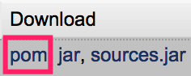

####分为中央仓库、服务器仓库、本地仓库。使用时查找顺序：本地仓库、服务器仓库、中央仓库。所有从中央仓库或服务器仓库下载来的jar包，都会存放在本地仓库中。

##### 中央仓库
默认地址：http://repo1.maven.org/maven2（或http://repo.maven.apache.org/maven2/、http://central.maven.org/maven2/）。配置在lib/maven-model-build.jar/org/apache/maven/model/pom.xml中，配置如下：
```
<repositories>
	<repository>
	  <id>central</id>
	  <name>Central Repository</name>
	  <url>http://repo1.maven.apache.org/maven2</url>
	  <releases>
	  	<enabled>true</enabled>
	  </releases>
	  <snapshots>
    	<enabled>true</enabled>
      	<updatePolicy>always</updatePolicy>
	  </snapshots>
	</repository>
</repositories>
```
1. 可以配置多个中央仓库  
在以上pom.xml或项目的pom.xml（只对项目有效）中，可以再配置<repositories>。注意，<id>不能重复。
	1. 可以配置多个<repository>，则依次从这些仓库下载包，连不上仓库或仓库中没有的包则从下一个仓库中获取。
	2. 当仓库地址是一个group
	可以使用：<snapshots>、<releases>。enabled为false，表示不会从group的snapshot仓库中获取jar包。
2. 设置中央仓库的镜像  
使用仓库时，如果有其镜像，则使用镜像的url。
	1. 在settings.xml的<mirrors>中配置：
	>
		<mirror>
		<id>maven1</id>   
		   <name>maven1</name>   
		   <url>仓库地址</url>  
		   //指定<repository>的id，可以使用id列表。每个id中还可以使用匹配符*。
		   <mirrorOf>central</mirrorOf>   
		</mirror>   
	2. 不能在pom.xml中配置<mirrors>。
3. 常用中央仓库地址  
可以在https://mvnrepository.com/中获取。注意，mvnrepository只是汇总了中央仓库，支持网页搜索，但并不是中央仓库，不能用于<repository>。

##### 服务器仓库（使用nexus）
1. hosted仓库（add时选择）  
用于存储本地上传的包。从该仓库中获取包时，没有不会去中央仓库下载。
	1. Snapshots、Release  
	用于存储本地上传的Snapshots包和Release包。  
	2. 3rd party 
	存放中央仓库没有的第三方库。
	3. group
	可以将多个仓库，合并成一个
	4. 使用nexus上传jar
	选中hosted仓库—下面窗口中选择Artifact Upload，可以在其中手动上传jar。
		1. GAV Definition可以手动指定jar包，也可以使用pom文件。
		如果使用了pom文件，则maven引用该jar后，可以通过pom文件的<dependency>分析进一步的引用。
		2. jar包一般自带pom文件（META-INF/maven/groupId/artifactId/pom.xml）。但，如果GAV Definition是手动指定jar包，则nexus会自动生成一个空的pom文件。注意，不会去解析jar中自带的pom文件。
			1. 使用mvn deploy时，会默认上传pom.xml，不需要手动指定。
		3. nexus中查找jar包时，可以从download tab中查看是否有pom。如图：
		
	4. 使用命令发布项目及上传jar包
	mvn deploy:deploy-file -DgroupId=x -DartifactId=x -Dversion=x -Dpackaging=x -Dfile=jar包 -DpomFile=pom文件 -Durl=http://106.15.88.137:8081/nexus/content/repositories/releases/ -DrepositoryId=mymaven
		1. url指定要发布到的仓库；repositoryId用来去setting.xml的<servers>中获取用户名和密码。
2. proxy仓库  
用于连接中央仓库，并存储下载的包；从该仓库中获取包时，没有会去其对应的中央仓库下载。  
	1. Central、Apache Snapshots、Condehaus Snapshots分别对应不同的中央仓库。
	2. 选中仓库—Browse Index，其中可以查看项目的包的Group、Artifact、Version。  
	只有从中央仓库下载过的包，才在Browse Index中有包的信息；  
	还可以在Configuration中设置Download Remote Indexes则会从中央仓库下载所有包的索引信息，加入Browse Index。  
	左上角的Aritifact Search，就是在所有仓库的Browse Index中查询包信息。
3. group仓库  
用于组合以上仓库为一个仓库组，则maven项目中只要配置了该group仓库，即相当于配置了仓库组中的每一个仓库。
	1. 选中group仓库—下面窗口中选择Configuration，其中可以将Available Repository窗口中的仓库加入仓库组。
4. 创建仓库和配置
	1. 创建仓库  
	打开Repositories窗口—add，加入仓库。
	2. 创建权限：包括权限和其对应的仓库。
	打开Privileges窗口—add—Repository选中新建的仓库，Repository Target选中授予仓库的权限：All(Maven2)。  
	All：包括了view、create、delete、read权限。
	3. 创建角色：包括给角色授权
	打开Roles窗口—Add Nexus Role—授权。
	4. 创建用户
	打开Users窗口—Add Nexus User—授予角色。  
	还可以给已存在的用户授予角色。

##### 本地仓库
window系统下默认位于用户目录/.m2/repository中。  
可以修改apache-maven\conf\settings.xml，在<settings>中加入<localRepository>指定仓库路径</localRepository>来指定仓库路径。

###### 其他
1. `插件下载的仓库，使用<pluginRepositories>配置，而不是<repositories>`
